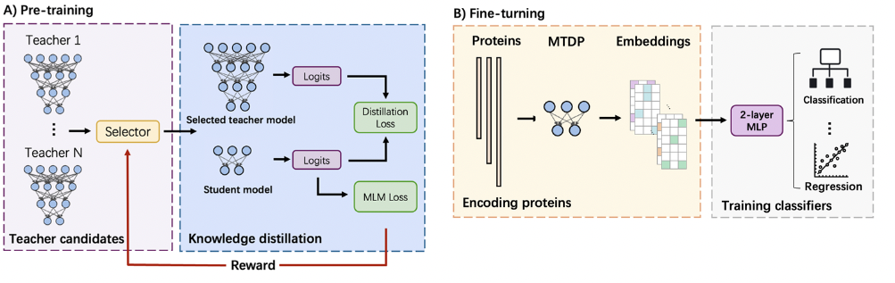
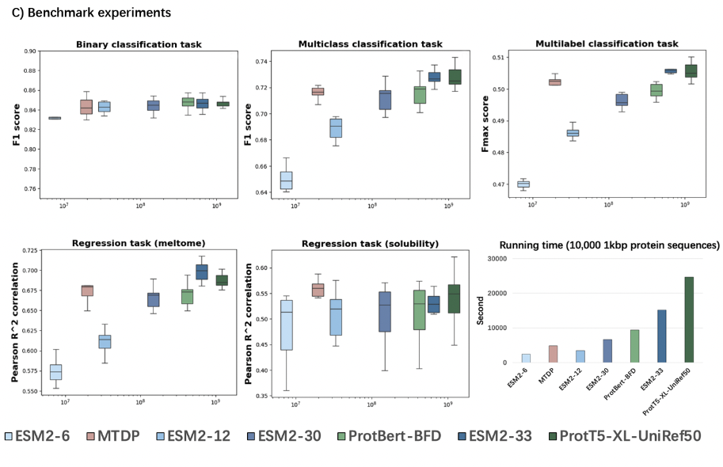

<h1 align="center">MTDP</h1>
<br/>

<br/>

[MTDP](https://github.com/KennthShang/MTDP): a Multi-Teacher Distillation approach for Protein embedding aims to enhance efficiency while preserving high-resolution representations. By leveraging the knowledge of multiple pre-trained protein embedding models, MTDP learns a compact and informative representation of proteins.


This repository will be updated regularly with **new pre-trained models for proteins** as part of supporting the **bioinformatics** community in general.

Table of Contents
=================
* [ &nbsp; News](#news)
* [ &nbsp; Installation](#install)
* [ &nbsp; Quick Start](#quick)
* [ &nbsp; Models Availability](#models)
* [ &nbsp; Dataset Availability](#datasets)
* [ &nbsp; Usage ](#usage)
  * [ &nbsp; Feature Extraction (FE)](#feature-extraction)
  * [ &nbsp; Fine Tuning (FT)](#fine-tuning)
  * [ &nbsp; Dilstillation](#prediction)
* [ &nbsp; Original downstream Predictions  ](#results)
* [ &nbsp; Followup use-cases  ](#inaction)
* [ &nbsp; Comparisons to other tools ](#comparison)
* [ &nbsp; Community and Contributions ](#community)
* [ &nbsp; Have a question? ](#question)
* [ &nbsp; Found a bug? ](#bug)
* [ &nbsp; License ](#license)
* [ &nbsp; Citation ](#citation)


<a name="news"></a>
## &nbsp; News
Currently, the provided model and the paper are based on the UniProtKB database, which is a small subset of the UniRef50 dataset widely used for training large models like ESM2-33 and ProtT5-XL-UniRef50. To address this limitation, we are training the UniRef50 and UniRef100 versions of MTDP. It is estimated that the training procedure of the UniRef50 version will last weeks. We will update this folder once it is finished.

<a name="install"></a>
## &nbsp; Installation
All our models are available via this folder or huggingface:

To install the packages easily, we provide a yaml file for conda installation.
```console
conda env create -f environment.yml
```

Then, before using MTDP, please run
```console
conda activate MTDP
```

Since the cuda version used for GPU acceleration in different devices may be different, Please refer the following instructions to check the Cuda version on your device:
[transformers installations](https://huggingface.co/docs/transformers/installation).
[PyTorch installations](https://pytorch.org/get-started/locally/).


<a name="quick"></a>
## &nbsp; Quick Start
Example for how to derive embeddings from our MTDP model (UniProtKB version):
```python
from transformers import T5Tokenizer, T5EncoderModel
import torch
import re
import numpy as np
from embedder import MTDP
from datasets import Dataset

device = torch.device('cuda:0' if torch.cuda.is_available() else 'cpu')

# Load the tokenizer
tokenizer = T5Tokenizer.from_pretrained('PATH_TO_MTDP/MTDP_tokenizer/', do_lower_case=False)

# Load the model
model = MTDP()
model.load_state_dict(torch.load(f'models/UniProtKB/UniProtKB.bin', map_location=device))


# prepare your protein sequences as a list
sequence_examples = ["PRTEINO", "SEQWENCE"]

# replace all rare/ambiguous amino acids by X and introduce white-space between all amino acids
sequence_examples = [" ".join(list(re.sub(r"[UZOB]", "X", sequence))) for sequence in sequence_examples]

# tokenize sequences and pad up to the longest sequence in the batch
ids = tokenizer(sequence_examples, add_special_tokens=True, padding="max_length", truncation=True, max_length=1001)
data = Dataset.from_dict(ids)


# generate embeddings
with torch.no_grad():
    input_ids = np.array([np.array(item) for item in data['input_ids']])
    input_ids = torch.Tensor(input_ids).long()
    mask = np.array([np.array(item) for item in data['attention_mask']])
    mask = torch.Tensor(mask).long()
    embedding_repr = model(input_ids=input_ids.to(device), attention_mask=mask.to(device))

final_embed = embedding_repr['logits'].detach().cpu().numpy() # shape: (2, 1280) 2 sequences, each has 1280-dimensional feature
```

This example code can only run in MTDP folder. We also have a [script](https://github.com/KennthShang/MTDP/get_embedding.py) which simplifies deriving the embeddings from MTDP for a given FASTA file in any path:
```
python get_embedding.py --inputs some.fasta --db path_to_MTDP_folder --outpth pth_to_output_folder
```
And the output file is named as *MTDP_embed.dict* in the output folder. The format is a dict in python with: 
```
KEY (accession of the sequence)
VALUE (the embedding of the sequence)
```


<a name="datasets"></a>
## &nbsp; Datasets Availability
|          Dataset              |                                    Pth                                    |  
| ----------------------------- | :---------------------------------------------------------------------------: |
|	Binary classification |      [Download](https://github.com/KennthShang/MTDP/tree/main/Datasets/deeploc)    |
|	Multiclass classification | [Download](https://github.com/KennthShang/MTDP/tree/main/Datasets/deeploc)  |
|	Multilabel classification	| [Download](https://github.com/KennthShang/MTDP/tree/main/Datasets/goterm) |
|	Regression (meltome)			| [Download](https://github.com/KennthShang/MTDP/tree/main/Datasets/meltome) |
|	Regression (solubility)				| [Download](https://github.com/KennthShang/MTDP/tree/main/Datasets/solubility) |

<a name="usage"></a>
## &nbsp; Usage  

How to use MTDP:

<a name="feature-extraction"></a>
 * <b>&nbsp; Feature Extraction (FE):</b><br/>
 Please check the [Quick Start](#quick) section


<a name="fine-tuning"></a>
 * <b>&nbsp; Fine Tuning (FT):</b><br/>
 Please check:
 [Fine Tuning](https://github.com/KennthShang/MTDP/tree/main/Finetuning) folder

<a name="Distillation"></a>
 * <b>&nbsp; Distillation:</b><br/>
 Please check:
 [Distillation](https://github.com/KennthShang/MTDP/tree/main/Distillation) folder

<a name="results"></a>
## &nbsp; Original downstream Predictions 



<a name="community"></a>
## &nbsp; Community and Contributions

The MTDP project is a **open source project** supported by various partner companies and research institutions. We are committed to **share all our pre-trained models and knowledge**. We are more than happy if you could help us on sharing new ptrained models, fixing bugs, proposing new feature, improving our documentation, spreading the word, or support our project.


<a name="question"></a>
## &nbsp; Have a question?

We are happy to hear your question in our issues page [MTDP](https://github.com/KennthShang/MTDP/issues)! Obviously if you have a private question or want to cooperate with us, you can always **reach out to us directly** via our email: jiayushang@cuhk.edu.hk 

<a name="bug"></a>
## &nbsp; Found a bug?

Feel free to **file a new issue** with a respective title and description on the [MTDP](https://github.com/KennthShang/MTDP/issues) repository. If you have already found a solution to your problem, **we would love to review your pull request**!


<a name="license"></a>
## &nbsp; License
The MTDP models are released under the under terms of the [Academic Free License v3.0 License](https://choosealicense.com/licenses/afl-3.0/).

<a name="citation"></a>
## &nbsp; Citation
If you use this code or our MTDP models for your publication, please cite the original paper:
```

```
